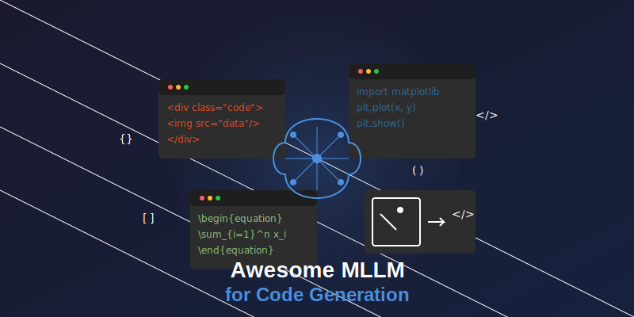

# Awesome-Multimodal-LLM-for-Code 

This repo includes papers about methods, benchmarks and evaluation for multimodal code generation.

[comment]: <> (multimodal code generation such as UI code generation, scientific plots code generation and so on.)

---

# 📜 Papers

> You can directly click on the title to jump to the corresponding PDF link location

## 1. Web/UI Code Generation

1. [**Design2Code: How Far Are We From Automating Front-End Engineering?.**](https://arxiv.org/abs/2403.03163) *Chenglei Si, Yanzhe Zhang, Zhengyuan Yang, Ruibo Liu, Diyi Yang
.* Arxiv 2024. &nbsp;&nbsp;&nbsp;&nbsp;&nbsp;&nbsp;&nbsp; 

2. [**Automatically Generating UI Code from Screenshot: A Divide-and-Conquer-Based Approach.**](https://arxiv.org/abs/2406.16386) *Yuxuan Wan, Chaozheng Wang, Yi Dong, Wenxuan Wang, Shuqing Li, Yintong Huo, Michael R. Lyu
.* Arxiv 2024.

3. [**Web2Code: A Large-scale Webpage-to-Code Dataset and Evaluation Framework for Multimodal LLMs.**](https://arxiv.org/abs/2406.20098) *Sukmin Yun, Haokun Lin, Rusiru Thushara, Mohammad Qazim Bhat, Yongxin Wang, Zutao Jiang, Mingkai Deng, Jinhong Wang, Tianhua Tao, Junbo Li, Haonan Li, Preslav Nakov, Timothy Baldwin, Zhengzhong Liu, Eric P. Xing, Xiaodan Liang, Zhiqiang Shen
.* Arxiv 2024. &nbsp;&nbsp;&nbsp;&nbsp;&nbsp;&nbsp;&nbsp; 

4. [**Prototype2Code: End-to-end Front-end Code Generation from UI Design Prototypes**](https://arxiv.org/abs/2405.04975) *Shuhong Xiao, Yunnong Chen, Jiazhi Li, Liuqing Chen, Lingyun Sun, Tingting Zhou
.* Arxiv 2024.

5. [**Bridging Design and Development with Automated Declarative UI Code Generation**](https://arxiv.org/abs/2409.11667) *Ting Zhou, Yanjie Zhao, Xinyi Hou, Xiaoyu Sun, Kai Chen, Haoyu Wang
.* Arxiv 2024.

6. [**Sketch2Code: Evaluating Vision-Language Models for Interactive Web Design Prototyping**](https://arxiv.org/abs/2410.16232) *Ryan Li, Yanzhe Zhang, Diyi Yang .* Arxiv 2024. &nbsp;&nbsp;&nbsp;&nbsp;&nbsp;&nbsp;&nbsp; 

## 2. Scientific Plots Code Generation

1. [**Plot2Code: A Comprehensive Benchmark for Evaluating Multi-modal Large Language Models in Code Generation from Scientific Plots.**](https://arxiv.org/abs/2405.07990) *Chengyue Wu, Yixiao Ge, Qiushan Guo, Jiahao Wang, Zhixuan Liang, Zeyu Lu, Ying Shan, Ping Luo
.* Arxiv 2024. &nbsp;&nbsp;&nbsp;&nbsp;&nbsp;&nbsp;&nbsp; 

2. [**MatPlotAgent: Method and Evaluation for LLM-Based Agentic Scientific Data Visualization.**](https://arxiv.org/abs/2402.11453) *Zhiyu Yang, Zihan Zhou, Shuo Wang, Xin Cong, Xu Han, Yukun Yan, Zhenghao Liu, Zhixing Tan, Pengyuan Liu, Dong Yu, Zhiyuan Liu, Xiaodong Shi, Maosong Sun
.* Arxiv 2024. &nbsp;&nbsp;&nbsp;&nbsp;&nbsp;&nbsp;&nbsp; 

3. [**ChartMimic: Evaluating LMM's Cross-Modal Reasoning Capability via Chart-to-Code Generation.**](https://arxiv.org/abs/2406.09961) Chufan Shi, Cheng Yang, Yaxin Liu, Bo Shui, Junjie Wang, Mohan Jing, Linran Xu, Xinyu Zhu, Siheng Li, Yuxiang Zhang, Gongye Liu, Xiaomei Nie, Deng Cai, Yujiu Yang
.* Arxiv 2024. &nbsp;&nbsp;&nbsp;&nbsp;&nbsp;&nbsp;&nbsp; 

## 3. Visually Rich Programming

1. [**MMCode: Evaluating Multi-Modal Code Large Language Models with Visually Rich Programming Problems.**](https://arxiv.org/abs/2404.09486) *Kaixin Li, Yuchen Tian, Qisheng Hu, Ziyang Luo, Jing Ma
.* Arxiv 2024. &nbsp;&nbsp;&nbsp;&nbsp;&nbsp;&nbsp;&nbsp; 

## 4. Dynamic Logo Code Generation

1. [**LogoMotion: Visually Grounded Code Generation for Content-Aware Animation.**](https://arxiv.org/abs/2405.07065) *Vivian Liu, Rubaiat Habib Kazi, Li-Yi Wei, Matthew Fisher, Timothy Langlois, Seth Walker, Lydia Chilton
.* Arxiv 2024.

## 5. Real-world Issue

1. [**SWE-bench Multimodal: Do AI Systems Generalize to Visual Software Domains?**](https://arxiv.org/abs/2410.03859) *John Yang, Carlos E. Jimenez, Alex L. Zhang, Kilian Lieret, Joyce Yang, Xindi Wu, Ori Press, Niklas Muennighoff, Gabriel Synnaeve, Karthik R. Narasimhan, Diyi Yang, Sida I. Wang, Ofir Press
.* Arxiv 2024.

## 6. General Benchmark

1. [**Image2Struct: Benchmarking Structure Extraction for Vision-Language Models**](https://arxiv.org/abs/2410.22456) *Josselin Somerville Roberts, Tony Lee, Chi Heem Wong, Michihiro Yasunaga, Yifan Mai, Percy Liang
.* Arxiv 2024.

